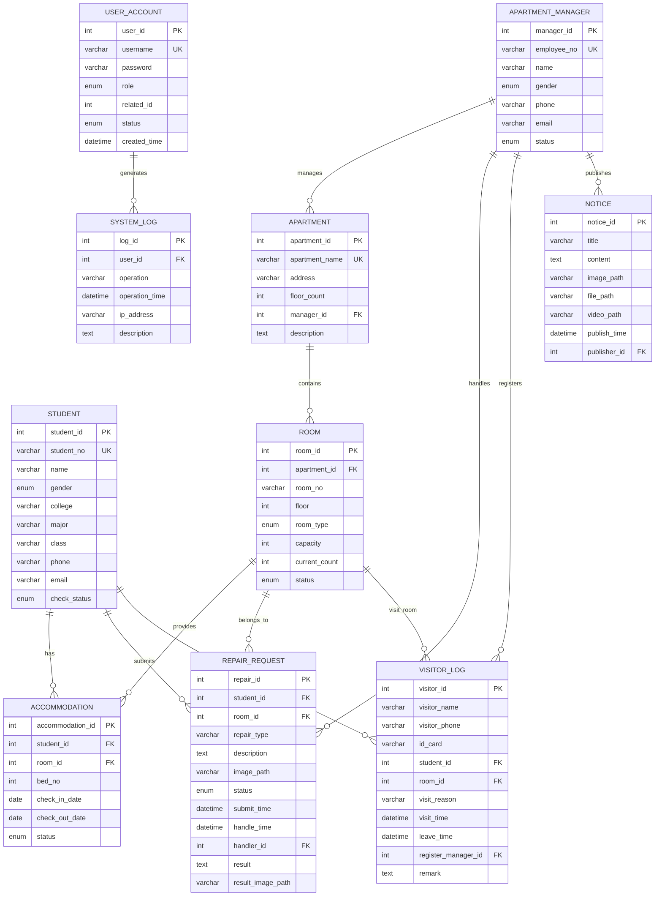

```mermaid
erDiagram
    USER_ACCOUNT {
        int user_id PK
        varchar username UK
        varchar password
        enum role
        int related_id
        enum status
        datetime created_time
    }

    STUDENT {
        int student_id PK
        varchar student_no UK
        varchar name
        enum gender
        varchar college
        varchar major
        varchar class
        varchar phone
        varchar email
        enum check_status
    }

    APARTMENT_MANAGER {
        int manager_id PK
        varchar employee_no UK
        varchar name
        enum gender
        varchar phone
        varchar email
        enum status
    }

    APARTMENT {
        int apartment_id PK
        varchar apartment_name UK
        varchar address
        int floor_count
        int manager_id FK
        text description
    }

    ROOM {
        int room_id PK
        int apartment_id FK
        varchar room_no
        int floor
        enum room_type
        int capacity
        int current_count
        enum status
    }

    ACCOMMODATION {
        int accommodation_id PK
        int student_id FK
        int room_id FK
        int bed_no
        date check_in_date
        date check_out_date
        enum status
    }

    REPAIR_REQUEST {
        int repair_id PK
        int student_id FK
        int room_id FK
        varchar repair_type
        text description
        varchar image_path
        enum status
        datetime submit_time
        datetime handle_time
        int handler_id FK
        text result
        varchar result_image_path
    }

    VISITOR_LOG {
        int visitor_id PK
        varchar visitor_name
        varchar visitor_phone
        varchar id_card
        int student_id FK
        int room_id FK
        varchar visit_reason
        datetime visit_time
        datetime leave_time
        int register_manager_id FK
        text remark
    }

    NOTICE {
        int notice_id PK
        varchar title
        text content
        varchar image_path
        varchar file_path
        varchar video_path
        datetime publish_time
        int publisher_id FK
    }

    SYSTEM_LOG {
        int log_id PK
        int user_id FK
        varchar operation
        datetime operation_time
        varchar ip_address
        text description
    }

    APARTMENT_MANAGER ||--o{ APARTMENT : manages
    APARTMENT ||--o{ ROOM : contains

    STUDENT ||--o{ ACCOMMODATION : has
    ROOM ||--o{ ACCOMMODATION : provides

    STUDENT ||--o{ REPAIR_REQUEST : submits
    ROOM ||--o{ REPAIR_REQUEST : belongs_to
    APARTMENT_MANAGER ||--o{ REPAIR_REQUEST : handles

    STUDENT ||--o{ VISITOR_LOG : visited_by
    ROOM ||--o{ VISITOR_LOG : visit_room
    APARTMENT_MANAGER ||--o{ VISITOR_LOG : registers

    APARTMENT_MANAGER ||--o{ NOTICE : publishes

    USER_ACCOUNT ||--o{ SYSTEM_LOG : generates
```