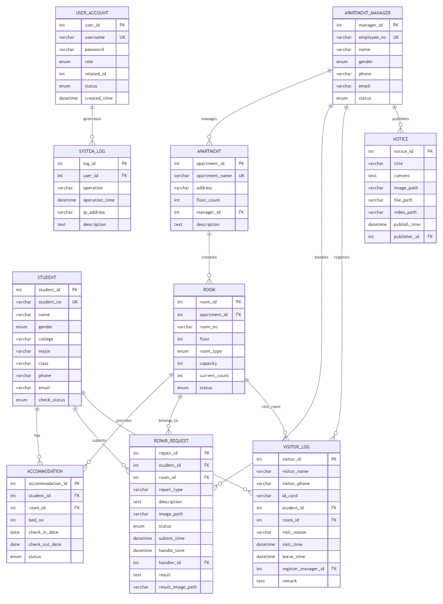
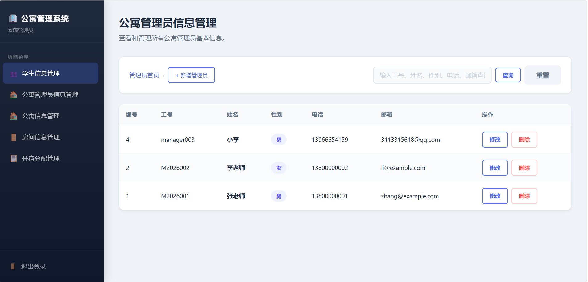
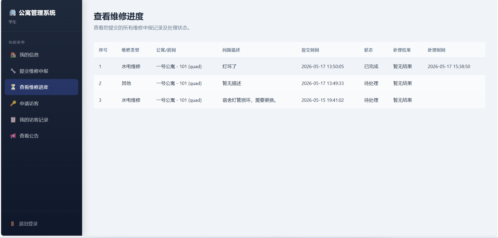
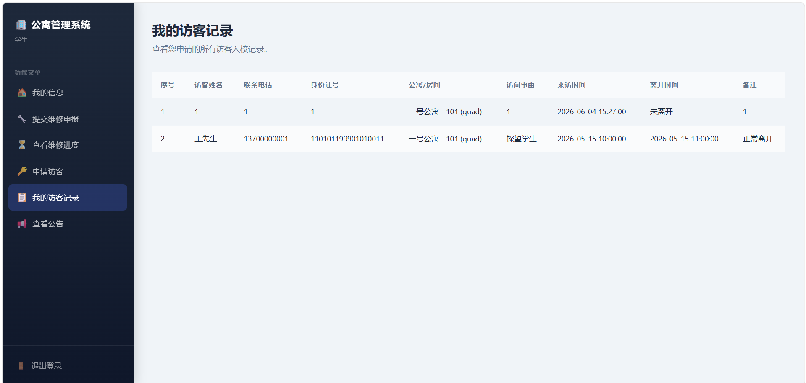

# <center>数据库系统及应用 — 课程设计报告

## <center>学生公寓管理系统

---

**课程名称**：数据库系统及应用

**课题名称**：学生公寓管理系统

**姓　　名**：任文博

**学　　号**：PB23111618

**日　　期**：2026年5月

---

> **项目仓库地址**：https://github.com/galaxyfox9996/db_student_apartment

---

## 目录

1. [需求分析](#一需求分析)
2. [概要设计（ER图）](#二概要设计er图)
3. [数据库模式设计](#三数据库模式设计)
4. [数据库3NF分析](#四数据库3nf分析)
5. [系统实现](#五系统实现)
6. [高级数据库特性](#六高级数据库特性)
7. [文件/图片/视频管理](#七文件图片视频管理)
8. [运行结果展示](#八运行结果展示)
9. [软件测试](#九软件测试)
10. [总结与展望](#十总结与展望)

---

## 一、需求分析

### 1.1 课题背景

高校学生公寓管理涉及大量学生住宿信息、房间资源调配、维修申报处理、访客登记等日常事务。传统的人工纸质或Excel管理方式效率低下，信息查询不便，且容易出现数据不一致。开发一套 **学生公寓管理系统** 能够实现公寓管理的信息化、规范化，提高管理效率。

### 1.2 用户角色与功能需求

本系统采用B/S架构，设定三类用户角色：

#### （1）系统管理员（admin）

| 功能模块 | 功能描述 |
|---------|---------|
| 学生信息管理 | 查看学生列表，新增、编辑、删除学生信息（学号、姓名、性别、学院、专业、班级、电话、邮箱） |
| 公寓管理员信息管理 | 查看公寓管理员列表，新增、编辑、删除管理员信息（工号、姓名、性别、电话、邮箱） |
| 公寓信息管理 | CRUD公寓基本信息（公寓名称、地址、楼层数、分配管理员、描述） |
| 房间信息管理 | 查看各公寓房间列表（房间号、楼层、类型、容量、当前入住人数、状态） |
| 住宿分配管理 | 为学生分配宿舍（自动匹配空闲房间及床位号），支持换宿和退宿 |
| 系统运行日志 | 查看所有用户的操作日志，支持按用户名、操作类型、日期范围进行分页筛选查询 |

#### （2）公寓管理员（manager）

| 功能模块 | 功能描述 |
|---------|---------|
| 所属公寓信息 | 查看自己管理的公寓及房间信息 |
| 维修申报处理 | 查看学生提交的维修申报，接收处理（pending→processing），完成维修并上传结果图片（processing→completed） |
| 访客登记管理 | 查看访客记录，为访客办理登记和离校登记 |
| 公告管理 | 发布公告（支持上传图片、文件附件、视频），删除自己发布的公告 |

#### （3）学生（student）

| 功能模块 | 功能描述 |
|---------|---------|
| 个人信息查看 | 查看自己的基本信息、住宿信息（公寓名称、房间号、床位号、入住日期） |
| 维修申报 | 提交维修申报（维修类型、描述、上传现场图片） |
| 维修进度查询 | 查看自己提交的维修申报列表及处理状态 |
| 公告查看 | 查看公寓管理员发布的所有公告 |
| 访客申请 | 为来访人员提交访客申请（访客姓名、电话、身份证号、来访时间、事由） |
| 访客历史 | 查看自己的访客历史记录 |

### 1.3 数据需求

系统需要管理以下核心数据实体：

| 实体 | 关键属性 |
|------|---------|
| 用户账户（user_account） | 用户名、密码、角色（admin/manager/student）、关联ID、账户状态 |
| 学生（student） | 学号、姓名、性别、学院、专业、班级、电话、邮箱、入住状态 |
| 公寓管理员（apartment_manager） | 工号、姓名、性别、电话、邮箱、工作状态 |
| 公寓（apartment） | 公寓名称、地址、楼层数、所属管理员、描述 |
| 房间（room） | 公寓归属、房间号、楼层、类型（单/双/四/六人间）、容量、当前入住人数、状态 |
| 住宿记录（accommodation） | 学生、房间、床位号、入住日期、退房日期、住宿状态 |
| 维修申报（repair_request） | 申报学生、房间、维修类型、描述、图片、状态、处理信息 |
| 访客记录（visitor_log） | 访客信息、被访学生、访问房间、时间、登记管理员 |
| 公告（notice） | 标题、内容、图片/文件/视频附件、发布时间、发布人 |
| 系统日志（system_log） | 操作用户、操作类型、操作时间、IP地址、操作说明 |

### 1.4 其他需求

- 系统中加入对图片、视频、文件的管理（维修图片上传、公告多媒体附件上传）
- 针对特定需求设计合理的 **存储过程、函数、事务、触发器**，四项均有
- 界面友好、功能完整
- 数据库满足3NF

---

## 二、概要设计（ER图）

### 2.1 实体-联系图（E-R Diagram）



### 2.2 实体说明

系统共包含10个实体，如下表所示：

| 序号 | 实体名称 | 中文含义 | 主键 | 备注 |
|------|---------|---------|------|------|
| 1 | user_account | 用户账户 | user_id | 统一认证，关联各角色 |
| 2 | student | 学生 | student_id | 学号唯一 |
| 3 | apartment_manager | 公寓管理员 | manager_id | 工号唯一 |
| 4 | apartment | 公寓 | apartment_id | 与管理员多对一 |
| 5 | room | 房间 | room_id | 与公寓多对一 |
| 6 | accommodation | 住宿记录 | accommodation_id | 关联学生与房间 |
| 7 | repair_request | 维修申报 | repair_id | 关联学生、房间、管理员 |
| 8 | visitor_log | 访客记录 | visitor_id | 关联学生、房间、管理员 |
| 9 | notice | 公告 | notice_id | 关联管理员 |
| 10 | system_log | 系统日志 | log_id | 关联用户账户 |

### 2.3 关系说明

- **apartment_manager — apartment**：1:N，一个管理员管理多个公寓
- **apartment — room**：1:N，一个公寓包含多个房间
- **student — accommodation**：1:N，一个学生可有多条住宿记录（历史换宿）
- **room — accommodation**：1:N，一个房间可容纳多个住宿记录
- **student — repair_request**：1:N，一个学生可提交多条维修申报
- **room — repair_request**：1:N，一个房间可有多条维修申报
- **apartment_manager — repair_request**：1:N，一个管理员可处理多条维修申报
- **student — visitor_log**：1:N，一个学生可被多次访问
- **room — visitor_log**：1:N，一个房间可关联多条访客记录
- **apartment_manager — visitor_log**：1:N，一个管理员可登记多个访客
- **apartment_manager — notice**：1:N，一个管理员可发布多条公告
- **user_account — system_log**：1:N，一个用户可产生多条操作日志

---

## 三、数据库模式设计

### 3.1 数据库基本信息

- **数据库平台**：MySQL 8.0
- **数据库名称**：`student_apartment_system`
- **字符集**：`utf8mb4`（支持emoji等4字节字符）
- **存储引擎**：InnoDB（支持事务、外键约束）

### 3.2 完整建表SQL

#### 3.2.1 用户表 user_account

```sql
CREATE TABLE user_account(
    user_id INT AUTO_INCREMENT PRIMARY KEY COMMENT '用户编号',
    username VARCHAR(50) NOT NULL UNIQUE COMMENT '用户名',
    password VARCHAR(255) NOT NULL COMMENT '密码',
    role ENUM('student','manager','admin') NOT NULL COMMENT '用户角色',
    related_id INT NOT NULL COMMENT '关联ID（student.student_id 或 apartment_manager.manager_id）',
    status ENUM('active','inactive') NOT NULL DEFAULT 'active' COMMENT '账户状态',
    created_time DATETIME NOT NULL DEFAULT CURRENT_TIMESTAMP COMMENT '创建时间'
) ENGINE=InnoDB DEFAULT CHARSET=utf8mb4 COMMENT='用户表';
```

**说明**：`related_id` 根据 `role` 不同分别关联学生表或公寓管理员表的主键。admin角色的`related_id`填0。

#### 3.2.2 学生表 student

```sql
CREATE TABLE student(
    student_id INT AUTO_INCREMENT PRIMARY KEY COMMENT '学生编号',
    student_no VARCHAR(20) NOT NULL UNIQUE COMMENT '学号',
    name VARCHAR(50) NOT NULL COMMENT '姓名',
    gender ENUM('male','female') NOT NULL COMMENT '性别',
    college VARCHAR(100) DEFAULT NULL COMMENT '学院',
    major VARCHAR(100) DEFAULT NULL COMMENT '专业',
    class VARCHAR(50) DEFAULT NULL COMMENT '班级',
    phone VARCHAR(20) DEFAULT NULL COMMENT '联系电话',
    email VARCHAR(100) DEFAULT NULL COMMENT '电子邮箱',
    check_status ENUM('not_checked_in','checked_in','checked_out') NOT NULL DEFAULT 'not_checked_in' COMMENT '入住状态'
) ENGINE=InnoDB DEFAULT CHARSET=utf8mb4 COMMENT='学生表';
```

#### 3.2.3 公寓管理员表 apartment_manager

```sql
CREATE TABLE apartment_manager(
    manager_id INT PRIMARY KEY AUTO_INCREMENT COMMENT '管理员编号',
    employee_no VARCHAR(20) NOT NULL UNIQUE COMMENT '工号',
    name VARCHAR(50) NOT NULL COMMENT '姓名',
    gender ENUM('male','female') NOT NULL COMMENT '性别',
    phone VARCHAR(20) DEFAULT NULL COMMENT '联系电话',
    email VARCHAR(100) DEFAULT NULL COMMENT '电子邮箱',
    status ENUM('active','inactive') NOT NULL DEFAULT 'active' COMMENT '工作状态'
) ENGINE=InnoDB DEFAULT CHARSET=utf8mb4 COMMENT='公寓管理员表';
```

#### 3.2.4 公寓表 apartment

```sql
CREATE TABLE apartment(
    apartment_id INT PRIMARY KEY AUTO_INCREMENT COMMENT '公寓编号',
    apartment_name VARCHAR(100) NOT NULL UNIQUE COMMENT '公寓名称',
    address VARCHAR(255) DEFAULT NULL COMMENT '公寓地址',
    floor_count INT NOT NULL COMMENT '楼层数',
    manager_id INT DEFAULT NULL COMMENT '管理员编号',
    description TEXT DEFAULT NULL COMMENT '公寓描述',
    CONSTRAINT fk_apartment_manager
        FOREIGN KEY (manager_id) REFERENCES apartment_manager(manager_id)
        ON UPDATE CASCADE ON DELETE SET NULL,
    CONSTRAINT chk_floor_count CHECK (floor_count > 0)
) ENGINE=InnoDB DEFAULT CHARSET=utf8mb4 COMMENT='公寓表';
```

#### 3.2.5 房间表 room

```sql
CREATE TABLE room(
    room_id INT PRIMARY KEY AUTO_INCREMENT COMMENT '房间编号',
    apartment_id INT NOT NULL COMMENT '公寓编号',
    room_no VARCHAR(20) NOT NULL COMMENT '房间号',
    floor INT NOT NULL COMMENT '楼层',
    room_type ENUM('single','double','quad','six') NOT NULL COMMENT '房间类型',
    capacity INT NOT NULL COMMENT '房间容量',
    current_count INT NOT NULL DEFAULT 0 COMMENT '当前入住人数',
    status ENUM('normal','repairing','disabled') NOT NULL DEFAULT 'normal' COMMENT '房间状态',
    CONSTRAINT fk_room_apartment
        FOREIGN KEY (apartment_id) REFERENCES apartment(apartment_id)
        ON UPDATE CASCADE ON DELETE CASCADE,
    CONSTRAINT uq_room_no UNIQUE (apartment_id, room_no),
    CONSTRAINT chk_floor CHECK (floor > 0),
    CONSTRAINT chk_capacity CHECK (capacity > 0),
    CONSTRAINT chk_current_count CHECK (current_count >= 0 AND current_count <= capacity)
) ENGINE=InnoDB DEFAULT CHARSET=utf8mb4 COMMENT='房间表';
```

**约束说明**：
- `(apartment_id, room_no)` 联合唯一约束，确保同一公寓下房间号不重复
- `chk_capacity`：容量必须大于0
- `chk_current_count`：当前入住人数在 `[0, capacity]` 范围内

#### 3.2.6 住宿记录表 accommodation

```sql
CREATE TABLE accommodation(
    accommodation_id INT PRIMARY KEY AUTO_INCREMENT COMMENT '住宿记录编号',
    student_id INT NOT NULL COMMENT '学生编号',
    room_id INT NOT NULL COMMENT '房间编号',
    bed_no INT NOT NULL COMMENT '床位号',
    check_in_date DATE NOT NULL COMMENT '入住日期',
    check_out_date DATE DEFAULT NULL COMMENT '退房日期',
    status ENUM('living','checkout','changed') NOT NULL DEFAULT 'living' COMMENT '住宿状态',
    CONSTRAINT fk_accommodation_student
        FOREIGN KEY (student_id) REFERENCES student(student_id)
        ON UPDATE CASCADE ON DELETE RESTRICT,
    CONSTRAINT fk_accommodation_room
        FOREIGN KEY (room_id) REFERENCES room(room_id)
        ON UPDATE CASCADE ON DELETE RESTRICT,
    CONSTRAINT chk_accommodation_dates CHECK (check_out_date IS NULL OR check_out_date >= check_in_date)
) ENGINE=InnoDB DEFAULT CHARSET=utf8mb4 COMMENT='住宿记录表';

CREATE INDEX idx_accommodation_student ON accommodation(student_id);
CREATE INDEX idx_accommodation_room ON accommodation(room_id);
CREATE INDEX idx_accommodation_status ON accommodation(status);
```

**说明**：`status` ENUM取值为 `living`（在住）、`checkout`（已退房）、`changed`（已换宿），保留历史记录。

#### 3.2.7 维修申报表 repair_request

```sql
CREATE TABLE repair_request(
    repair_id INT PRIMARY KEY AUTO_INCREMENT COMMENT '维修编号',
    student_id INT NOT NULL COMMENT '申报学生编号',
    room_id INT NOT NULL COMMENT '维修房间编号',
    repair_type VARCHAR(100) NOT NULL COMMENT '维修类型（水电维修/门窗维修/家具维修/其他）',
    description TEXT DEFAULT NULL COMMENT '维修描述',
    image_path VARCHAR(255) DEFAULT NULL COMMENT '现场图片路径（支持图片管理）',
    status ENUM('pending','processing','completed') NOT NULL DEFAULT 'pending' COMMENT '维修状态',
    submit_time DATETIME NOT NULL DEFAULT CURRENT_TIMESTAMP COMMENT '提交时间',
    handle_time DATETIME DEFAULT NULL COMMENT '处理完成时间',
    handler_id INT DEFAULT NULL COMMENT '处理人编号（公寓管理员）',
    result TEXT DEFAULT NULL COMMENT '处理结果说明',
    result_image_path VARCHAR(255) DEFAULT NULL COMMENT '处理结果图片路径',
    CONSTRAINT fk_repair_student
        FOREIGN KEY (student_id) REFERENCES student(student_id)
        ON UPDATE CASCADE ON DELETE RESTRICT,
    CONSTRAINT fk_repair_room
        FOREIGN KEY (room_id) REFERENCES room(room_id)
        ON UPDATE CASCADE ON DELETE RESTRICT,
    CONSTRAINT fk_repair_handler
        FOREIGN KEY (handler_id) REFERENCES apartment_manager(manager_id)
        ON UPDATE CASCADE ON DELETE SET NULL
) ENGINE=InnoDB DEFAULT CHARSET=utf8mb4 COMMENT='维修记录表';

CREATE INDEX idx_repair_student ON repair_request(student_id);
CREATE INDEX idx_repair_room ON repair_request(room_id);
CREATE INDEX idx_repair_status ON repair_request(status);
```

#### 3.2.8 访客登记表 visitor_log

```sql
CREATE TABLE visitor_log(
    visitor_id INT PRIMARY KEY AUTO_INCREMENT COMMENT '访客编号',
    visitor_name VARCHAR(50) NOT NULL COMMENT '访客姓名',
    visitor_phone VARCHAR(20) DEFAULT NULL COMMENT '访客联系电话',
    id_card VARCHAR(30) DEFAULT NULL COMMENT '访客身份证号',
    student_id INT NOT NULL COMMENT '被访学生编号',
    room_id INT NOT NULL COMMENT '被访房间编号',
    visit_reason VARCHAR(255) DEFAULT NULL COMMENT '访问事由',
    visit_time DATETIME NOT NULL COMMENT '来访时间',
    leave_time DATETIME DEFAULT NULL COMMENT '离开时间',
    register_manager_id INT DEFAULT NULL COMMENT '登记管理员编号（未登记表示未确认）',
    remark TEXT DEFAULT NULL COMMENT '备注信息',
    CONSTRAINT fk_visitor_student
        FOREIGN KEY (student_id) REFERENCES student(student_id)
        ON UPDATE CASCADE ON DELETE RESTRICT,
    CONSTRAINT fk_visitor_room
        FOREIGN KEY (room_id) REFERENCES room(room_id)
        ON UPDATE CASCADE ON DELETE RESTRICT,
    CONSTRAINT chk_visit_times CHECK (leave_time IS NULL OR leave_time >= visit_time)
) ENGINE=InnoDB DEFAULT CHARSET=utf8mb4 COMMENT='访客登记表';

CREATE INDEX idx_visitor_student ON visitor_log(student_id);
CREATE INDEX idx_visitor_room ON visitor_log(room_id);
CREATE INDEX idx_visitor_visit_time ON visitor_log(visit_time);
```

#### 3.2.9 公告表 notice

```sql
CREATE TABLE notice(
    notice_id INT PRIMARY KEY AUTO_INCREMENT COMMENT '公告编号',
    title VARCHAR(255) NOT NULL COMMENT '公告标题',
    content TEXT NOT NULL COMMENT '公告内容',
    image_path VARCHAR(255) DEFAULT NULL COMMENT '公告图片路径',
    file_path VARCHAR(255) DEFAULT NULL COMMENT '公告附件路径（支持文件管理）',
    video_path VARCHAR(255) DEFAULT NULL COMMENT '公告视频路径（支持视频管理）',
    publish_time DATETIME NOT NULL DEFAULT CURRENT_TIMESTAMP COMMENT '发布时间',
    publisher_id INT DEFAULT NULL COMMENT '发布人编号',
    CONSTRAINT fk_notice_publisher
        FOREIGN KEY (publisher_id) REFERENCES apartment_manager(manager_id)
        ON UPDATE CASCADE ON DELETE SET NULL
) ENGINE=InnoDB DEFAULT CHARSET=utf8mb4 COMMENT='公告表';

CREATE INDEX idx_notice_publisher ON notice(publisher_id);
CREATE INDEX idx_notice_publish_time ON notice(publish_time);
```

#### 3.2.10 系统日志表 system_log

```sql
CREATE TABLE system_log(
    log_id INT PRIMARY KEY AUTO_INCREMENT COMMENT '日志编号',
    user_id INT NOT NULL COMMENT '操作用户编号',
    operation VARCHAR(100) NOT NULL COMMENT '操作类型',
    operation_time DATETIME NOT NULL DEFAULT CURRENT_TIMESTAMP COMMENT '操作时间',
    ip_address VARCHAR(50) DEFAULT NULL COMMENT 'IP地址',
    description TEXT DEFAULT NULL COMMENT '操作说明',
    CONSTRAINT fk_log_user
        FOREIGN KEY (user_id) REFERENCES user_account(user_id)
        ON UPDATE CASCADE ON DELETE CASCADE
) ENGINE=InnoDB DEFAULT CHARSET=utf8mb4 COMMENT='系统日志表';

CREATE INDEX idx_log_user ON system_log(user_id);
CREATE INDEX idx_log_operation_time ON system_log(operation_time);
```

### 3.3 外键关系总览

| 子表 | 外键字段 | 父表 | 父表主键 | 更新策略 | 删除策略 |
|------|---------|------|---------|---------|---------|
| apartment | manager_id | apartment_manager | manager_id | CASCADE | SET NULL |
| room | apartment_id | apartment | apartment_id | CASCADE | CASCADE |
| accommodation | student_id | student | student_id | CASCADE | RESTRICT |
| accommodation | room_id | room | room_id | CASCADE | RESTRICT |
| repair_request | student_id | student | student_id | CASCADE | RESTRICT |
| repair_request | room_id | room | room_id | CASCADE | RESTRICT |
| repair_request | handler_id | apartment_manager | manager_id | CASCADE | SET NULL |
| visitor_log | student_id | student | student_id | CASCADE | RESTRICT |
| visitor_log | room_id | room | room_id | CASCADE | RESTRICT |
| notice | publisher_id | apartment_manager | manager_id | CASCADE | SET NULL |
| system_log | user_id | user_account | user_id | CASCADE | CASCADE |

### 3.4 索引设计

| 索引名 | 表 | 字段 | 用途 |
|--------|---|------|------|
| idx_accommodation_student | accommodation | student_id | 查询某学生的住宿记录 |
| idx_accommodation_room | accommodation | room_id | 查询某房间的入住学生 |
| idx_accommodation_status | accommodation | status | 筛选在住/已退房记录 |
| idx_repair_student | repair_request | student_id | 查询某学生的维修申报 |
| idx_repair_room | repair_request | room_id | 查询某房间的维修记录 |
| idx_repair_status | repair_request | status | 按状态筛选维修申报 |
| idx_visitor_student | visitor_log | student_id | 查询某学生的访客 |
| idx_visitor_room | visitor_log | room_id | 查询某房间的访客 |
| idx_visitor_visit_time | visitor_log | visit_time | 按时间排序访客记录 |
| idx_notice_publisher | notice | publisher_id | 查询某管理员发布的公告 |
| idx_notice_publish_time | notice | publish_time | 按时间排序公告 |
| idx_log_user | system_log | user_id | 查询某用户的操作日志 |
| idx_log_operation_time | system_log | operation_time | 按时间排序/筛选日志 |

---

## 四、数据库3NF分析

### 4.1 第一范式（1NF）

所有表均满足1NF：每个列都是原子值，不存在重复列或多值字段。所有表都定义了主键，ENUM类型存储单一值。

### 4.2 第二范式（2NF）

所有表均满足2NF：不存在非主属性对候选键的部分函数依赖（所有表主键均为单列代理键，无复合主键，自动满足2NF）。

### 4.3 第三范式（3NF）

逐表分析传递依赖情况：

#### 表1：user_account 满足3NF
- 候选键：`user_id`（PK），`username`（UNIQUE）
- 所有非主属性直接依赖于主键，无传递依赖

#### 表2：student 满足3NF
- `student_no` → `name, gender, college, major, class, phone, email, check_status`
- 但 `student_no` 是候选键（UNIQUE），不构成传递依赖

#### 表3：apartment_manager 满足3NF
- `employee_no` 是候选键，不构成传递依赖

#### 表4：apartment 满足3NF
- 所有属性（`apartment_name`、`address`、`floor_count`、`description`）均直接由 `apartment_id` 决定
- `manager_id` 是外键，不构成传递依赖

#### 表5：room 满足3NF
- 所有非主属性直接由 `room_id` 决定
- `apartment_id` 是外键，不构成传递依赖

#### 表6：accommodation 满足3NF
- `student_id` 和 `room_id` 均为外键，不构成传递依赖
- 所有属性直接依赖主键 `accommodation_id`

#### 表7：repair_request 满足3NF
- `student_id`、`room_id`、`handler_id` 均为外键
- 所有属性直接依赖主键 `repair_id`

#### 表8：visitor_log 满足3NF
- 所有属性直接依赖主键 `visitor_id`
- 无传递依赖

#### 表9：notice 满足3NF
- `publisher_id` 为外键
- 所有属性直接依赖主键 `notice_id`

#### 表10：system_log 满足3NF
- `user_id` 为外键
- 所有属性直接依赖主键 `log_id`

### 4.4 结论

**本系统所有10张表均满足3NF**，无需进行模式降级。设计过程中通过代理主键（自增ID）和适当的外键引用，避免了传递依赖的产生。ENUM类型的使用确保了数据完整性，CHECK约束进一步强化了业务规则验证。

---

## 五、系统实现

### 5.1 系统架构

- **架构模式**：B/S（Browser/Server）
- **前端**：HTML5 + CSS3 + Jinja2模板引擎
- **后端**：Python 3 + Flask Web框架
- **数据库**：MySQL 8.0
- **数据库驱动**：PyMySQL
- **字符集**：UTF-8（utf8mb4）

### 5.2 项目结构

```
dblab2/
├── app.py                  # 主程序（Flask路由、业务逻辑）
├── config.py               # 数据库连接配置
├── requirements.txt        # Python依赖
├── er.png                  # ER图
├── er.md                   # ER图Mermaid源码
├── static/
│   ├── style.css           # 全局样式
│   └── uploads/            # 上传文件目录
│       ├── notices/        # 公告附件（图片/文件/视频）
│       └── repairs/        # 维修申报图片
├── templates/              # 前端模板
│   ├── login.html          # 登录页
│   ├── admin_index.html    # admin首页
│   ├── admin_log.html      # admin系统日志页
│   ├── student_list.html   # admin学生列表
│   ├── student_add.html    # admin添加学生
│   ├── student_edit.html   # admin编辑学生
│   ├── manager_list.html   # admin管理员列表
│   ├── manager_add.html    # admin添加管理员
│   ├── manager_edit.html   # admin编辑管理员
│   ├── apartment_list.html # admin公寓列表
│   ├── room_list.html      # admin房间列表
│   ├── assign_list.html    # admin住宿分配列表
│   ├── assign_room.html    # admin住宿分配
│   ├── assign_result.html  # admin分配结果
│   ├── manager_*.html      # manager相关页面
│   └── student_*.html      # student相关页面
└── sql/
    ├── create_tables.sql   # 建表SQL
    ├── insert_data.sql     # 测试数据
    ├── functions.sql       # 函数
    ├── procedures.sql      # 存储过程
    ├── transactions.sql    # 事务
    ├── triggers.sql        # 触发器
    └── test.sql            # 测试SQL
```

### 5.3 核心代码解析

#### 5.3.1 Flask主程序初始化 (app.py)

```python
from flask import Flask, render_template, request, redirect, url_for, session
import pymysql
from config import DB_CONFIG

app = Flask(__name__)
app.secret_key = "student_apartment_secret_key"

def get_db_connection():
    """获取数据库连接，使用字典游标"""
    return pymysql.connect(
        host=DB_CONFIG["host"],
        user=DB_CONFIG["user"],
        password=DB_CONFIG["password"],
        database=DB_CONFIG["database"],
        charset=DB_CONFIG["charset"],
        cursorclass=pymysql.cursors.DictCursor
    )
```

- 使用 `pymysql.cursors.DictCursor` 使查询结果以字典形式返回，方便模板渲染
- 每次请求独立创建数据库连接，通过 `try...finally` 确保连接释放

#### 5.3.2 系统日志写入函数

```python
def write_log(operation, description=None):
    user_id = session.get("user_id")
    if not user_id:
        return
    ip_address = request.remote_addr
    conn = get_db_connection()
    with conn.cursor() as cursor:
        sql = """INSERT INTO system_log (user_id, operation, operation_time, ip_address, description)
                 VALUES (%s, %s, NOW(), %s, %s)"""
        cursor.execute(sql, (user_id, operation, ip_address, description))
        conn.commit()
```

- 所有关键操作（登录、增删改等）均调用 `write_log` 写入系统日志
- 自动记录操作用户、操作类型、时间、IP地址

#### 5.3.3 用户登录与权限控制

```python
@app.route("/login", methods=["GET", "POST"])
def login():
    if request.method == "POST":
        username = request.form.get("username")
        password = request.form.get("password")
        # 查询用户并验证密码
        conn = get_db_connection()
        with conn.cursor() as cursor:
            cursor.execute(
                "SELECT * FROM user_account WHERE username=%s AND password=%s AND status='active'",
                (username, password)
            )
            user = cursor.fetchone()
        if user:
            session["user_id"] = user["user_id"]
            session["role"] = user["role"]
            session["related_id"] = user["related_id"]
            write_log("用户登录")
            # 根据角色跳转不同首页
            if user["role"] == "admin":
                return redirect(url_for("admin_index"))
            elif user["role"] == "manager":
                return redirect(url_for("manager_index"))
            elif user["role"] == "student":
                return redirect(url_for("student_index"))
    return render_template("login.html")
```

- 使用 `session` 存储用户身份信息
- 各路由通过 `session.get("role")` 进行角色权限校验
- 登录成功记录日志

#### 5.3.4 住宿分配逻辑（双模式：自动分配 + 手动选床）

```python
@app.route("/admin/assign/<int:student_id>", methods=["GET", "POST"])
def assign_room(student_id):
    if session.get("role") != "admin":
        return redirect(url_for("login"))

    # 查询学生信息、所有公寓、所有有空位的房间（供前端级联选择）
    ...

    if request.method == "POST":
        assign_mode = request.form.get("assign_mode", "auto")  # 'auto' 或 'manual'

        if assign_mode == "manual":
            # === 手动选床分配 ===
            room_id = request.form.get("room_id")
            bed_no = request.form.get("bed_no")

            # 1. 检查学生是否已入住
            cursor.execute("SELECT COUNT(*) AS cnt FROM accommodation WHERE student_id = %s AND status = 'living'", (student_id,))
            if cursor.fetchone()["cnt"] > 0: raise "已入住"

            # 2. 检查床位是否已被占用
            cursor.execute("SELECT COUNT(*) AS cnt FROM accommodation WHERE room_id = %s AND bed_no = %s AND status = 'living'", (room_id, bed_no))
            if cursor.fetchone()["cnt"] > 0: raise "床位已占用"

            # 3. 检查房间是否已满
            cursor.execute("SELECT capacity, current_count FROM room WHERE room_id = %s", (room_id,))
            room = cursor.fetchone()
            if room["current_count"] >= room["capacity"]: raise "房间已满"

            # 4. 插入住宿记录 → 触发器自动更新 current_count → 更新学生入住状态
            cursor.execute("INSERT INTO accommodation ...", (student_id, room_id, bed_no, ...))
            cursor.execute("UPDATE student SET check_status = 'checked_in' WHERE student_id = %s", (student_id,))
        else:
            # === 自动分配：调用存储过程 ===
            cursor.execute("CALL proc_auto_assign_room(%s, %s, %s)", (student_id, apartment_id, room_type))
            result = cursor.fetchone()
            conn.commit()

            # 检查存储过程是否返回了错误消息（存储过程通过 EXIT HANDLER 捕获异常后返回 SELECT，不会抛出异常）
            msg = result.get("message", "") if result else ""
            if msg and msg.startswith("分配宿舍失败"):
                return render_template("assign_result.html", error=msg)
```

**模式说明**：

| 模式 | 实现方式 | 特点 |
|------|---------|------|
| **自动分配** | 调用存储过程 `proc_auto_assign_room` | 系统自动查找同公寓同类型的有空位房间，分配床位号（current_count + 1） |
| **手动选床** | Python 业务逻辑层逐级校验 | 管理员手动选择公寓→房间→床位号，每步均进行学生是否已入住、床位是否被占用、房间是否已满的三重校验 |

**遇到的BUG**：自动分配模式下，存储过程通过 `EXIT HANDLER` 捕获异常后执行 `SELECT CONCAT('分配宿舍失败，原因：', ...) AS message`，不会向 Python 端抛出异常。原代码未区分成功/失败消息，导致失败时也显示"分配成功"。修复后在 `fetchone()` 后检查 `message` 是否以 `"分配宿舍失败"` 开头，若是则作为 `error` 传递而非 `result`。

#### 5.3.5 住宿分配辅助 API 接口

为支持手动选床模式下的级联下拉框交互，提供了两个 AJAX JSON API：

**API 1：获取公寓下有空位的房间列表**

```python
@app.route("/admin/api/available_rooms")
def api_available_rooms():
    apartment_id = request.args.get("apartment_id")
    sql = """SELECT r.room_id, r.room_no, r.room_type, r.floor, r.capacity, r.current_count,
                    (r.capacity - r.current_count) AS available_beds
             FROM room r
             WHERE r.apartment_id = %s AND r.status = 'normal' AND (r.capacity - r.current_count) > 0
             ORDER BY r.floor ASC, r.room_no ASC"""
    cursor.execute(sql, (apartment_id,))
    rooms = cursor.fetchall()
    return {"rooms": rooms}  # JSON 响应
```

**API 2：获取房间的空闲床位号列表**

```python
@app.route("/admin/api/room_beds/<int:room_id>")
def api_room_beds(room_id):
    # 获取房间容量 — 已占用床位号 → 生成可用床位号列表
    cursor.execute("SELECT capacity, current_count FROM room WHERE room_id = %s AND status = 'normal'", (room_id,))
    room = cursor.fetchone()
    cursor.execute("SELECT bed_no FROM accommodation WHERE room_id = %s AND status = 'living'", (room_id,))
    occupied = set(row["bed_no"] for row in cursor.fetchall())
    available_beds = [i for i in range(1, room["capacity"] + 1) if i not in occupied]
    return {"room_id": room_id, "capacity": room["capacity"], "available_beds": available_beds}
```

这两个 API 通过前端的 `fetch()` 异步调用，实现：选择公寓 → 自动加载房间下拉框 → 选择房间 → 自动加载床位号下拉框。

#### 5.3.6 文件上传处理（维修图片/公告附件）

```python
# 文件上传核心逻辑（以维修图片为例）
file = request.files.get("image")
if file and file.filename:
    ext = filename.rsplit(".", 1)[-1].lower()
    if ext not in ("jpg", "jpeg", "png", "gif", "webp"):
        return "只允许上传jpg、jpeg、png、gif、webp格式的图片"
    file.seek(0, 2)  # 移动到文件末尾获取大小
    size = file.tell()
    if size > 5 * 1024 * 1024:
        return "图片大小不能超过5MB"
    file.seek(0)  # 重置到开头
    save_name = f"{uuid.uuid4().hex}_{filename}"
    save_path = os.path.join(upload_dir, save_name)
    file.save(save_path)
    image_path = f"uploads/repairs/{save_name}"
```

- UUID生成唯一文件名，避免冲突
- 文件大小限制5MB
- 图片格式白名单校验（jpg/jpeg/png/gif/webp）
- 公告支持图片、文件（pdf/doc/docx/xls/xlsx）、视频（mp4/avi/mov）三种类型

### 5.4 前端界面设计

前端采用原生HTML+CSS+JavaScript实现，包括：

- **侧边栏导航**：左侧固定侧边栏，包含功能菜单，当前页高亮显示
- **响应式设计**：支持PC端和移动端，移动端显示顶部栏+底部内容
- **表格展示**：数据表格包含悬停高亮、状态Badge、操作按钮
- **分页控件**：日志页、列表页均有分页导航
- **筛选搜索**：支持多条件组合筛选（用户名、操作类型、日期范围）
- **双Tab分配界面**：`assign_room.html` 提供"自动分配"和"手动选床"两个Tab页签，用户可切换分配模式
- **级联下拉框**：手动选床模式下，选择公寓后自动通过 AJAX 加载其下有空位的房间列表，选择房间后自动加载空闲床位号，实现三级联动选择

---

## 六、高级数据库特性

### 6.1 存储过程 — proc_auto_assign_room

**功能**：自动为学生分配宿舍

```sql
CREATE PROCEDURE proc_auto_assign_room(
    IN p_student_id INT,
    IN p_apartment_id INT,
    IN p_room_type VARCHAR(20)
)
BEGIN
    DECLARE v_room_id INT DEFAULT NULL;
    DECLARE v_bed_no INT DEFAULT NULL;
    DECLARE EXIT HANDLER FOR SQLEXCEPTION
    BEGIN
        GET DIAGNOSTICS CONDITION 1 v_error_message = MESSAGE_TEXT;
        ROLLBACK;
        SELECT CONCAT('分配宿舍失败，原因：', v_error_message) AS message;
    END;

    START TRANSACTION;
    -- 1. 判断学生是否存在
    -- 2. 判断学生是否已经入住
    -- 3. 查找符合条件的空闲房间（同公寓、同类型、status='normal'、有空位）
    -- 4. 分配床位号（current_count + 1）
    -- 5. 插入住宿记录（accommodation）
    -- 6. 更新学生入住状态为 checked_in
    -- 7. 触发器自动更新房间 current_count
    COMMIT;
END
```

**特点**：
- 使用事务确保分配操作的原子性
- `EXIT HANDLER FOR SQLEXCEPTION` 异常处理，自动回滚
- `SIGNAL SQLSTATE '45000'` 主动抛出业务异常
- 按楼层和房间号升序查找，优先分配低楼层房间

### 6.2 函数 — func_get_available_beds

**功能**：计算指定房间的剩余可用床位数

```sql
CREATE FUNCTION func_get_available_beds(p_room_id INT)
RETURNS INT
DETERMINISTIC
READS SQL DATA
BEGIN
    DECLARE total_beds INT;
    DECLARE current_count INT;
    DECLARE available_beds INT;

    SELECT capacity, current_count
    INTO total_beds, current_count
    FROM room WHERE room_id = p_room_id;

    SET available_beds = total_beds - current_count;
    RETURN available_beds;
END
```

**特点**：
- `DETERMINISTIC`：确定函数，相同输入总返回相同结果
- `READS SQL DATA`：只读取数据，不修改
- 可用于SELECT查询中，方便前端展示

**调用示例**：
```sql
SELECT room_id, room_no, func_get_available_beds(room_id) AS available_beds
FROM room;
```

### 6.3 事务 — proc_change_room

**功能**：学生换宿操作

```sql
CREATE PROCEDURE proc_change_room(
    IN p_student_id INT,
    IN p_new_room_id INT,
    IN p_new_bed_no INT
)
BEGIN
    DECLARE EXIT HANDLER FOR SQLEXCEPTION
    BEGIN
        ROLLBACK;
        SELECT '换宿失败，发生异常' AS message;
    END;

    START TRANSACTION;
    -- 1. 获取学生当前住宿信息
    -- 2. 验证新床位未被占用
    -- 3. 将原住宿记录状态改为 'changed'，填写退房日期
    -- 4. 插入新的住宿记录（状态 'living'）
    -- 5. 更新学生入住状态
    COMMIT;
END
```

**事务保证**：换宿涉及2条UPDATE和1条INSERT，共3个DML操作。通过事务确保要么全部成功，要么全部回滚，避免出现"旧宿舍已退、新宿舍未入住"的数据不一致状态。

### 6.4 触发器（共4个）

#### 触发器1：trg_after_student_check_in

```sql
CREATE TRIGGER trg_after_student_check_in
AFTER INSERT ON accommodation
FOR EACH ROW
BEGIN
    IF NEW.status = 'living' THEN
        UPDATE room SET current_count = current_count + 1
        WHERE room_id = NEW.room_id;
    END IF;
END
```

**功能**：学生入住后自动增加房间当前入住人数，维护数据一致性。

#### 触发器2：trg_after_accommodation_update

```sql
CREATE TRIGGER trg_after_accommodation_update
AFTER UPDATE ON accommodation
FOR EACH ROW
BEGIN
    IF OLD.status = 'living' AND NEW.status IN ('checkout','changed') THEN
        UPDATE room SET current_count = current_count - 1
        WHERE room_id = NEW.room_id AND current_count > 0;
    END IF;
END
```

**功能**：学生退房或换宿时自动减少原房间入住人数。

#### 触发器3：trg_after_repair_report_insert

```sql
CREATE TRIGGER trg_after_repair_report_insert
AFTER INSERT ON repair_request
FOR EACH ROW
BEGIN
    DECLARE v_user_id INT;
    SELECT user_id INTO v_user_id
    FROM user_account
    WHERE role = 'student' AND related_id = NEW.student_id;
    IF v_user_id IS NOT NULL THEN
        INSERT INTO system_log (user_id, operation, ip_address, description)
        VALUES (v_user_id, '提交维修申报', NULL, CONCAT('学生提交维修申报，维修编号:', NEW.repair_id));
    END IF;
END
```

**功能**：学生提交维修申报后，自动写入系统日志，实现审计追踪。

#### 触发器4：trg_after_repair_status_update

```sql
CREATE TRIGGER trg_after_repair_status_update
BEFORE UPDATE ON repair_request
FOR EACH ROW
BEGIN
    IF NEW.status = 'completed' AND OLD.status <> 'completed' AND NEW.handle_time IS NULL THEN
        SET NEW.handle_time = NOW();
    END IF;
END
```

**功能**：维修状态更新为"已完成"时自动记录处理时间，无需应用层手动设置。

---

## 七、文件/图片/视频管理

### 7.1 管理需求

根据课程设计要求："系统中加入对图片、视频、文件的管理"。本系统在以下两个模块中实现了多媒体文件管理：

### 7.2 维修申报 — 图片管理

- **上传场景**：学生提交维修申报时，可上传现场图片
- **存储路径**：`static/uploads/repairs/`
- **文件命名**：`{UUID}_{原始文件名}` — 使用UUID避免文件名冲突
- **格式校验**：仅允许 jpg、jpeg、png、gif、webp
- **大小限制**：5MB
- **存储方式**：文件存储在服务器磁盘，数据库 `image_path` 字段存储相对路径
- **管理员处理**：管理员处理维修时也可上传处理结果图片（`result_image_path`）

### 7.3 公告管理 — 图片/文件/视频管理

- **上传场景**：公寓管理员发布公告时，可上传图片、文件附件和视频
- **存储路径**：`static/uploads/notices/`
- **支持格式**：
  - 图片：jpg、jpeg、png、gif、webp
  - 文件：pdf、doc、docx、xls、xlsx
  - 视频：mp4、avi、mov
- **大小限制**：每种类型均限制5MB
- **数据库字段**：`image_path`、`file_path`、`video_path` — 三列独立存储

### 7.4 技术实现要点

```python
import uuid, os

upload_dir = os.path.join("static", "uploads", "notices")
os.makedirs(upload_dir, exist_ok=True)  # 自动创建目录

# 获取上传文件
img_file = request.files.get("image")
if img_file and img_file.filename:
    # 校验文件扩展名
    ext = filename.rsplit(".", 1)[-1].lower()
    if ext not in allowed_extensions:
        return "格式不允许"
    # 校验文件大小（seek到末尾获取）
    img_file.seek(0, 2)
    size = img_file.tell()
    img_file.seek(0)
    if size > 5 * 1024 * 1024:
        return "文件过大"
    # 保存
    save_name = f"{uuid.uuid4().hex}_{filename}"
    img_file.save(os.path.join(upload_dir, save_name))
```

---

## 八、运行结果展示

### 8.1 用户登录


*图：用户登录页面，选择角色后输入用户名和密码登录*

### 8.2 系统管理员首页


*图：系统管理员首页，展示功能卡片导航和侧边栏菜单*

### 8.3 学生信息管理


*图：学生信息列表，支持搜索、新增、编辑、删除操作*

### 8.4 公寓管理员信息管理



*图：公寓管理员信息列表，支持搜索、新增、编辑、删除操作*

### 8.5 公寓信息管理


*图：公寓信息列表管理页面*

### 8.6 房间信息管理


*图：房间信息列表，展示各房间容量和入住情况*

### 8.7 住宿分配管理


*图：住宿分配页面，选择学生、公寓和房间类型后自动分配*

### 8.8 系统运行日志


*图：系统运行日志页面，支持按用户名、操作类型、日期范围筛选和分页*

### 8.9 公寓管理员首页


*图：公寓管理员首页*

### 8.10 维修申报处理


*图：公寓管理员查看和处理学生维修申报*

### 8.11 公告发布


*图：发布公告，支持上传图片、文件附件和视频*

### 8.12 访客登记管理


*图：访客登记与离校管理页面*

### 8.13 学生首页


*图：学生首页，展示最新公告*

### 8.14 学生个人信息


*图：学生查看自己的基本信息和住宿信息*

### 8.15 维修申报


*图：学生提交维修申报，可上传现场图片*

### 8.16 访客申请


*图：学生为来访人员提交访客申请*

### 8.17 公告查看


*图：学生查看公寓公告列表*

### 8.18 维修进度查看



*图：学生查看维修进度*

### 8.19 访客记录



*图：学生查看访客历史*

---

## 九、软件测试

### 9.1 测试环境

- **操作系统**：Windows 11
- **Python版本**：3.11
- **MySQL版本**：8.0
- **浏览器**：Chrome 最新版

### 9.2 测试SQL脚本 (test.sql)

```sql
USE student_apartment_system;

-- 1. 查看所有表
SHOW TABLES;

-- 2. 查看初始化数据
SELECT * FROM student;
SELECT * FROM room;

-- 3. 测试函数：计算各房间剩余床位
SELECT room_id, room_no, capacity, current_count,
       func_get_available_beds(room_id) AS available_beds
FROM room;

-- 4. 测试存储过程：为3号学生分配一号公寓四人间
CALL proc_auto_assign_room(3, 1, 'quad');
SELECT * FROM accommodation WHERE student_id = 3;
SELECT * FROM room WHERE apartment_id = 1;

-- 5. 查看住宿记录（验证触发器是否更新了房间人数）
SELECT * FROM accommodation;
SELECT room_id, room_no, current_count FROM room;
```

### 9.3 功能测试用例

| 编号 | 测试项 | 输入 | 预期结果 | 状态 |
|------|-------|------|---------|------|
| T01 | 管理员登录 | username=admin, password=123456 | 跳转管理员首页 | ✓ |
| T02 | 错误密码登录 | username=admin, password=wrong | 提示"用户名或密码错误" | ✓ |
| T03 | 添加学生 | 填写完整学生信息 | 新增成功，列表可见 | ✓ |
| T04 | 学号重复 | 添加已存在的学号 | 数据库报错或提示重复 | ✓ |
| T05 | 自动分配宿舍 | 选未入住学生+公寓+四人间 | 分配成功，显示房间和床位号 | ✓ |
| T06 | 手动选床分配 | 选学生→选公寓→选房间→选床位 | 分配成功，床位号与所选一致 | ✓ |
| T07 | 重复分配（自动） | 已入住学生再次自动分配 | 显示"分配宿舍失败，原因：学生已经入住"（❌失败页面，非✅成功页面） | ✓ |
| T08 | 重复分配（手动） | 已入住学生再次手动选床 | 提示"该学生已经入住" | ✓ |
| T09 | 提交维修申报 | 选类型+描述+上传图片 | 申报成功，写入日志 | ✓ |
| T10 | 未入住申报维修 | 未入住学生申报 | 提示"未入住，无法申报" | ✓ |
| T11 | 管理员处理维修 | 接收→完成维修 | 状态更新，记录处理时间（触发器） | ✓ |
| T12 | 发布公告+附件 | 标题+内容+图片+文件+视频 | 公告发布成功 | ✓ |
| T13 | 上传超大文件 | 选择>5MB图片 | 提示"图片大小不能超过5MB" | ✓ |
| T14 | 非法格式文件 | 选择.exe文件 | 提示格式不允许 | ✓ |
| T15 | 访客申请 | 填写访客信息+时间 | 申请成功 | ✓ |
| T16 | 访客登记 | 管理员登记来访 | register_manager_id更新 | ✓ |
| T17 | 访客离校 | 管理员登记离校 | leave_time更新 | ✓ |
| T18 | 查看系统日志 | admin访问/admin/logs | 显示所有操作日志，支持筛选 | ✓ |
| T19 | 角色权限校验 | student访问/admin/* | 重定向到登录页 | ✓ |
| T20 | 换宿操作 | 已入住学生换到新房间 | 旧记录变changed，新记录living，房间人数更新 | ✓ |

---

## 十、总结与展望

### 10.1 项目总结

本项目完成了一个基于B/S架构的**学生公寓管理系统**，主要包括以下成果：

1. **需求分析**：明确了三类用户角色（系统管理员、公寓管理员、学生）共20+个功能需求
2. **数据库设计**：设计了10张满足3NF的数据表，包含完整的外键约束、CHECK约束、UNIQUE约束和索引
3. **ER图设计**：清晰描述了实体间的1:N关系
4. **系统实现**：使用Python Flask框架开发了完整的前后端系统
5. **高级数据库特性**：
   - 存储过程 `proc_auto_assign_room` — 自动分配宿舍
   - 函数 `func_get_available_beds` — 计算剩余床位
   - 事务 `proc_change_room` — 换宿操作的事务保证
   - 4个触发器 — 自动化维护数据一致性
6. **多媒体文件管理**：系统支持图片、视频、文件的上传和管理
7. **系统日志**：完整记录用户操作，支持多条件筛选和分页查询

### 10.2 遇到问题与解决

| 问题 | 解决方案 |
|------|---------|
| 住宿分配时房间人数未自动更新 | 创建AFTER INSERT触发器，自动更新room表的current_count |
| 维修申报与系统日志的联动 | 创建AFTER INSERT触发器，自动将维修申报写入system_log |
| 文件上传重名覆盖 | 使用UUID生成唯一文件名 |
| 大文件上传 | 限制文件大小5MB，前端使用multipart/form-data |
| MySQL字符集中文乱码 | 统一使用utf8mb4字符集和utf8mb4_general_ci排序规则 |
| 分页查询效率 | 建表时为常用查询字段创建索引 |
| 自动分配失败时错误显示为"分配成功" | 存储过程通过 EXIT HANDLER 返回错误 SELECT 但未向 Python 抛异常，需在 `fetchone()` 后检查 `message` 是否以 `'分配宿舍失败'` 开头，若是则作为 `error` 而非 `result` 传给模板 |

### 10.3 展望

- 可引入Elasticsearch实现更高效的全文本搜索
- 可引入Redis缓存热点数据，提升并发性能
- 可使用WebSocket实现实时通知
- 可引入Docker容器化部署，简化环境配置

---

## 附录

### 附录A：参考资料

1. Python Flask官方文档：https://flask.palletsprojects.com/
2. PyMySQL官方文档：https://pymysql.readthedocs.io/
3. MySQL 8.0 Reference Manual：https://dev.mysql.com/doc/refman/8.0/en/
4. 课程设计文档 `db-lab02_2026.pdf`

### 附录B：项目启动

```bash
# 1. 安装依赖
pip install -r requirements.txt

# 2. 初始化数据库（执行顺序）
mysql -u root -p < sql/create_tables.sql
mysql -u root -p < sql/insert_data.sql
mysql -u root -p < sql/functions.sql
mysql -u root -p < sql/procedures.sql
mysql -u root -p < sql/triggers.sql

# 3. 启动应用
python app.py

# 4. 浏览器自动打开 http://127.0.0.1:5000
```

### 附录C：测试账号

| 角色 | 用户名 | 密码 |
|------|--------|------|
| 系统管理员 | admin | 123456 |
| 公寓管理员 | manager001 | 123456 |
| 学生 | 20260001 | 123456 |

---

> **报告完成日期**：2026年5月
>
> **项目仓库地址**：[https://github.com/galaxyfox9996/db_student_apartment]